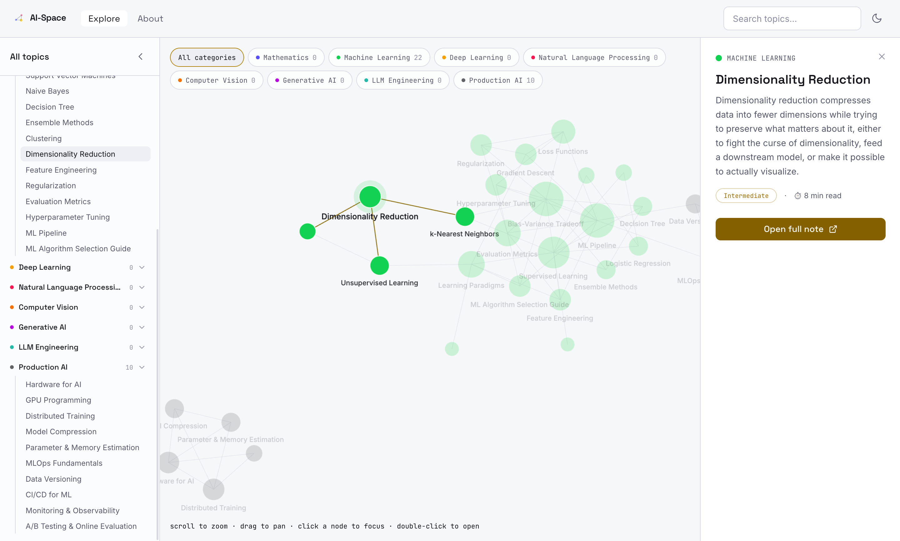

# AI-Dictionary

**An Interactive Knowledge Graph for AI Concepts. Every concept is a node & Every edge is a relationship.**

 

  <!-- App -->
  
  
  
  
  
  <!-- Graph & Motion -->
  
  
  
  <!-- Tooling & Deployment -->
  

  

**Live:** [ai-dictionary-vert.vercel.app](https://ai-dictionary-vert.vercel.app/)

## Motivation

Modern AI knowledge is fragmented. Definitions live in one place, research papers in another, tutorials somewhere else, and the relationships between concepts are often left for you to figure out.

AI-Dictionary is an attempt to organize that knowledge into a single visual reference. Instead of treating concepts as isolated entries, it connects them into a knowledge graph where every concept is linked to the ideas that explain it, build upon it, or apply it. The goal isn't just to define terms—it's to provide context.

Whether you're revisiting the fundamentals of linear algebra, understanding why Transformers changed deep learning, or tracing the evolution from supervised fine-tuning to modern LLM post-training techniques, AI-Dictionary helps you explore concepts through their relationships rather than in isolation.

This project is built for students, researchers, engineers, and anyone curious about artificial intelligence. It is open source, continuously evolving, and aims to provide a reliable reference that stays relevant as the AI ecosystem continues to evolve.

**N.B:** This project is still under progress. You can find the list of topics to be covered [here](./docs/project-guide.md#topic-organization).

## What it does

- **Interactive knowledge graph** — every AI concept is a node; every real relationship is an edge you can pan to, zoom into, and follow (GPU-rendered, smooth even with hundreds of nodes)
- **Full-text search**, category filtering, light/dark theme, and a responsive layout that adapts the graph UI for mobile/tablet rather than just shrinking it

## Tech stack

- **App:** React 19 · TypeScript · Vite · Tailwind CSS 4 · Zustand
- **Graph:** PixiJS (WebGL rendering) · d3-force (layout physics) · GSAP (camera/hover motion)
- **Content:** react-markdown · remark-gfm · remark-math + KaTeX · Mermaid · Fuse.js (search)
- **Tooling:** Vitest · oxlint · GitHub Actions (CI) · Vercel (hosting/CD)

## Contributing

This is a live, evolving reference — contributions for **UI/UX improvements, bug fixes, or corrections to inaccurate/outdated concept information** are welcome. See [`CONTRIBUTING.md`](./CONTRIBUTING.md) *(coming soon)* for how to propose changes and the content format.

## License

[MIT](./LICENSE) — free and open source.