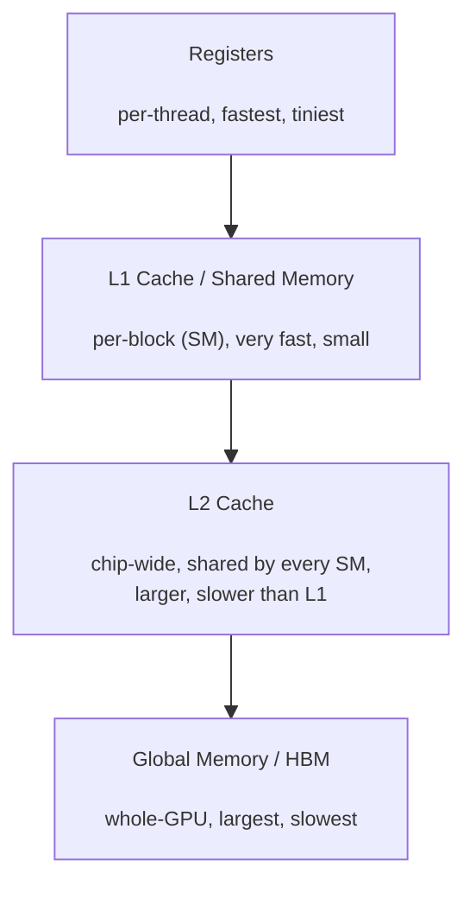

# GPU Programming

## Motivation

[Hardware for AI](/topic/hardware-for-ai) explained *why* a GPU is fast in principle — thousands of simple cores, all doing the same operation at once. But having that hardware doesn't mean any given piece of code actually uses it well.

PyTorch already ships fast, pre-written kernels for common operations like matrix multiply. Most model code never has to think below that layer. But when an operation is new, or several operations get chained together in a way nobody pre-optimized, PyTorch falls back to something slow. Understanding how a GPU actually executes code is what explains why that fallback is slow — and what a hand-written kernel does differently.

## What Is a Kernel? A Concrete Example

A **kernel** is just a function that runs on the GPU, written so that many copies of it can run at the same time, on different pieces of data.

Take the simplest possible example: adding two vectors of a million numbers each, `C[i] = A[i] + B[i]` for every `i` from 0 to 999,999.

- **On a CPU**, this is a loop: add `A[0]+B[0]`, then `A[1]+B[1]`, one at a time, a million times in sequence (or maybe 8–16 at a time if the CPU splits it across its cores).
- **On a GPU**, this is a kernel launched with one million threads — one thread per index `i`. Every thread runs the exact same one line of code, `C[i] = A[i] + B[i]`, but each thread has a different value of `i` and works on a different slice of the data. All million additions happen essentially at once, instead of one after another.

This is the entire idea behind GPU programming: instead of writing a loop, you write **what one thread does**, and launch enough threads to cover the whole problem. A matrix multiply kernel works the same way — one thread computes one element of the output matrix and thousands of threads run simultaneously to fill in the whole matrix at once.

**Where CUDA fits in:** CUDA (Compute Unified Device Architecture) is NVIDIA's platform for writing exactly this kind of code — it's a small set of extensions to C++, plus a compiler and runtime, that let a programmer write a kernel like the vector-add example above, specify how many threads/blocks to launch, and run it on an NVIDIA GPU. It's not a separate language so much as "C++ with GPU-specific keywords and functions bolted on." CUDA only runs on NVIDIA hardware, which is a large part of why NVIDIA GPUs became the default choice for deep learning — the software ecosystem (CUDA itself, plus cuBLAS/cuDNN built on top of it) matured years ahead of alternatives for other vendors' chips.

## Threads, Blocks, Grids, Warps

Threads aren't launched as one giant flat pool — they're organized into a hierarchy, matching how the GPU chip itself is physically organized.

| Level | What it is | Analogy |
|---|---|---|
| **Thread** | Runs one instance of the kernel, works on one small piece of data | One worker |
| **Block** | A group of threads (e.g. 256) that run together on the same physical chunk of the GPU, and can share fast local memory | A team sharing one whiteboard |
| **Grid** | All the blocks needed to cover the entire problem | The whole workforce, split into teams |
| **Warp** | A group of exactly 32 threads inside a block, that physically execute the *same instruction, at the same clock cycle*, on different data | A 32-person squad marching in lockstep |

The warp detail matters in practice: if code has an `if` statement, and different threads in the same warp go into different branches, the GPU cannot run both branches at once — it runs the `if` branch first (with the other threads idle), then the `else` branch (with the first threads idle now). This is called **warp divergence**, and it's one of the most common, most avoidable reasons a GPU kernel runs far slower than it should. The fix, when possible, is writing code where nearby threads take the same branch.

## GPU Memory: The Memory Pyramid

Not all GPU memory is equally fast, and this is the single biggest thing separating a naive kernel from a well-written one. Memory on a GPU forms a pyramid — the closer to a thread, the faster and smaller it gets:

| Memory | Speed | Size | Who can access it | Analogy |
|---|---|---|---|---|
| **Registers** | Fastest | Tiny | One thread | Your own pocket |
| **L1 Cache / Shared Memory** | Very fast | A few hundred KB | One block (one SM) | A shelf in your team's room |
| **L2 Cache** | Fast | Several MB | The whole GPU, across every SM | A supply closet shared by every team on the floor |
| **Global Memory (HBM)** | Slow | Tens of GB | The whole GPU | A warehouse across town |

Two things worth being precise about here:

- **L1 cache and shared memory physically share the same on-chip block per SM**, just used differently. Shared memory is explicitly managed by the programmer — you decide what gets copied in and when, as in the tiling example below. L1 cache is automatically managed by the hardware, catching repeated accesses to the same address without the programmer doing anything.
- **L2 cache sits between the SMs and global memory**, shared by the entire GPU rather than one block. Its job is catching global-memory accesses that repeat *across different thread blocks* — something an individual block's L1/shared memory can't do, since those are private to one block. A value fetched from HBM by one block can be served out of L2 the next time a completely different block asks for it, without going back to slow HBM at all.

**A worked example — matrix multiply, without and with tiling:**

Say two 1024×1024 matrices are being multiplied. A naive kernel has every thread independently re-read the same rows and columns straight from slow global memory, over and over — the same row of matrix A gets re-read from global memory by every thread that needs it, redundantly, thousands of times.

A **tiled** kernel instead has each block load a small tile (say 32×32) of both matrices into fast shared memory *once*, and then every thread in that block reuses that same tile from shared memory many times over, instead of hitting slow global memory again for each reuse. This one pattern — load once into shared memory, reuse many times — is behind most of the real-world speedup a hand-written kernel gets over the naive version.

**Coalescing** is the second big lever: when the 32 threads in a warp read 32 *consecutive* memory addresses, the GPU serves the whole warp in a single wide transaction. If those same 32 threads instead read scattered, non-consecutive addresses, the GPU needs many slow, separate transactions instead of one fast one — same data, same math, potentially an order of magnitude slower, purely from how memory was laid out and accessed.

## Tensor Cores

Everything so far — CUDA cores, the memory pyramid, tiling, coalescing — describes ordinary GPU compute: one thread, one multiply-add, one clock cycle. Starting with NVIDIA's Volta architecture, GPUs also ship a second, specialized kind of compute unit inside every SM: **Tensor Cores**, built to do an entire small matrix multiply-accumulate — `D = A×B + C`, where A, B, C, D are small matrices — in a single operation, instead of many individual scalar multiply-adds spread across many CUDA-core threads.

Because matrix multiplication is *the* dominant operation in deep learning (recall from [Hardware for AI](/topic/hardware-for-ai) that this is the whole reason GPUs suit deep learning in the first place), routing that specific operation onto purpose-built hardware rather than general-purpose CUDA cores gives a large throughput jump — tensor cores can push several times to an order of magnitude more matrix-multiply throughput than the same GPU's ordinary CUDA cores, at the same clock speed.

**The catch, and why it matters for [Model Compression](/topic/model-compression):** tensor cores are precision-specific. They accelerate FP16, BF16, and INT8 matrix multiplication (and FP8 on the newest chips) at full speed — they do **not** accelerate FP32 matmul the same way. This is the actual hardware reason mixed-precision training and quantization aren't just "smaller," they're **faster**: running a matmul in FP16 instead of FP32 doesn't just halve the memory footprint, it routes the computation onto tensor cores instead of ordinary CUDA cores, which is where the real speedup comes from. Pure memory savings alone wouldn't explain the throughput jump mixed precision and quantization actually deliver in practice — the hardware underneath is why. In roofline-model terms from [Hardware for AI](/topic/hardware-for-ai), tensor cores raise the peak compute ceiling *C*, specifically for the lower-precision formats they support.

## Kernel Optimization: Fusion and FlashAttention

Every time execution moves from one GPU operation to the next, the result of the first operation has to be written out to slow global memory, then read back in for the second operation — even for something trivial.

**Before fusion:** computing `y = GELU(x @ W + b)` as three separate kernels — matrix multiply, add bias, apply GELU — writes the intermediate result to global memory and reads it back in, *twice*, purely to hand off between steps that have nothing to do with the actual math.

**After fusion:** one kernel computes the matrix multiply, adds the bias, and applies GELU, all while the data is still sitting in fast registers/shared memory — global memory is touched once at the very start (reading the inputs) and once at the very end (writing the final result).

**The real-world example every LLM engineer runs into is FlashAttention**, and it's worth walking through in full, since it's the clearest illustration of everything in this note working together.

Standard attention computes the full N×N score matrix (`QKᵀ`), applies softmax to it, then multiplies by `V`. Written naively, that's three separate kernels, each round-tripping its output through slow global memory — exactly the fusion problem above, just attention-shaped. At long sequence lengths this dominates runtime, and not because attention needs more FLOPs: it's memory-bound, per the roofline model from [Hardware for AI](/topic/hardware-for-ai), because moving the full N×N matrix to and from HBM is the bottleneck, not the arithmetic itself.

**FlashAttention's fix:** fuse the entire attention computation — scores, softmax, weighted sum — into a single kernel that processes the sequence in small tiles, keeping each tile of Q, K, V and all intermediate results in fast on-chip SRAM the whole time. The full N×N score matrix is never written to HBM at all.

**The catch this creates, and how it's solved:** softmax normally needs the entire row of scores at once — the max value and the sum of exponentials across the whole row — to normalize correctly. But with tiling, only one small block of that row is ever in memory at a time. FlashAttention solves this with **online softmax**: a running max and running sum get updated incrementally as each new tile arrives, with a small rescaling correction applied at the end. The result is mathematically identical to standard softmax, computed without ever holding the full row in memory at once.

The payoff: FlashAttention computes the *exact* same attention output as the naive version — no approximation — while touching HBM far less. Memory usage grows linearly with sequence length instead of quadratically, since the N×N matrix is never materialized, which is what turns into real, measured speedups on long sequences. Later versions (FlashAttention-2, FlashAttention-3) mostly tune the same core idea further — better work partitioning across thread blocks and warps — rather than changing the fundamental approach.

## The Actual Tech Stack

In practice, almost nobody writes raw kernels from scratch for everyday model code — here's what's actually used, at each level:

| Tool | Level | When it's used |
|---|---|---|
| **cuBLAS / cuDNN** | NVIDIA's own pre-written kernel libraries | What PyTorch calls under the hood for standard ops (matrix multiply, convolution) — most model code never goes below this |
| **Triton** (from OpenAI) | Python-embedded kernel language | Writing a custom fused kernel without hand-managing memory and thread indices — the default choice today for custom kernels |
| **flash-attn** | Purpose-built library | The actual, widely-used implementation of FlashAttention described above — most projects install this rather than writing the kernel themselves |
| **Raw CUDA (C++)** | Lowest level | Squeezing out the last bit of performance, or hardware-specific tricks Triton doesn't expose |
| **CUTLASS** (NVIDIA) | C++ template library | Building custom, high-performance matrix-multiply-based kernels, including ones that target tensor cores directly, without starting completely from scratch |

**Triton in one sentence:** it looks like ordinary Python with array operations, but the compiler turns it into a real GPU kernel, and it automatically handles a lot of the memory coalescing and low-level scheduling detail that's easy to get wrong by hand — which is why most custom LLM kernels (including several fast attention implementations) are written in it today, rather than raw CUDA.

## Where this fits

GPU programming is what turns the raw hardware capability from [Hardware for AI](/topic/hardware-for-ai) into actual measured speed — the same chip can run a naive kernel or a tiled, coalesced, fused one at wildly different throughput on identical math, and tensor cores add a second axis entirely, rewarding lower-precision formats with real hardware speedups rather than just smaller storage. This note is also the foundation [Inference Optimization](/topic/inference-optimization) builds on when it surveys FlashAttention and kernel fusion from the serving-latency angle — that node gives the quick, decode-phase-specific summary; the actual mechanism lives here. It's also the layer underneath the communication operations (like all-reduce) that make [Distributed Training](/topic/distributed-training) across multiple GPUs work.

## Further reading

The [NVIDIA CUDA C++ Programming Guide](https://docs.nvidia.com/cuda/cuda-c-programming-guide/) is the authoritative reference for the CUDA model, memory hierarchy, and tensor cores covered, [Tillet, Kung & Cox's Triton paper](https://dl.acm.org/doi/10.1145/3315508.3329973) introduces the language and compiler behind the tech-stack section, and [Dao et al.'s FlashAttention paper](https://arxiv.org/abs/2205.14135) is the full source for tiling and online-softmax algorithm, with [Dao's FlashAttention-2 paper](https://arxiv.org/abs/2307.08691) covering the later work-partitioning improvements.